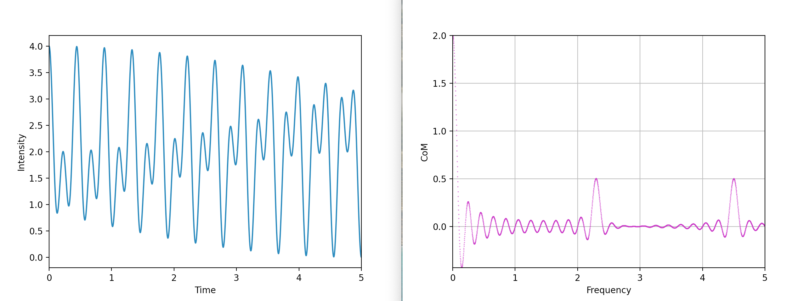

# Fourier Transform Visualisation

A visualisation of the continuous Fourier transform in Python.

All scripts in the "sinusoidal" directory relate to a 3Hz pure sinusoidal tone.
There is a commented 2.3Hz + 4.5Hz tone in each file's "definitions" section as well.

The files in the "normal distribution" directory display the interesting phenomena that the Fourier Transform of a Gaussian function results in another Gaussian function.

Much of this code is inspired by the 3Blue1Brown video "[But what is the Fourier Transform? A visual introduction.](https://www.youtube.com/watch?v=spUNpyF58BY)".